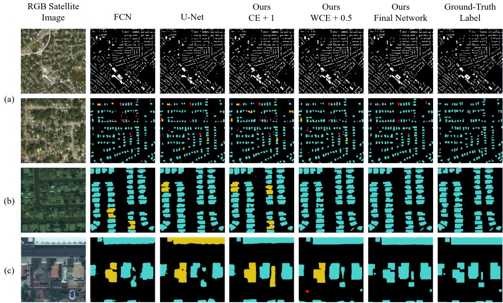

## A Semantic Segmentation Network for Urban-Scale Building Footprint Extraction Using RGB Satellite Imagery

This repository is the official implementation of **[A Semantic Segmentation Network for Urban-Scale Building Footprint Extraction Using RGB Satellite Imagery](https://arxiv.org/abs/2104.01263)** by Aatif Jiwani, Shubhrakanti Ganguly, Chao Ding, Nan Zhou, and David Chan. 



### Requirements

1. To install GDAL/`georaster`, please follow this [doc](https://mothergeo-py.readthedocs.io/en/latest/development/how-to/gdal-ubuntu-pkg.html) for instructions. 
2. Install other dependencies from requirements.txt
```setup
pip install -r requirements.txt
```

### Datasets

#### Downloading the Datasets
1. To download the AICrowd dataset, please go [here](https://www.aicrowd.com/challenges/mapping-challenge-old). You will have to either create an account or sign in to access the training and validation set. Please store the training/validation set inside `<root>/AICrowd/<train | val>` for ease of conversion.
2. To download the Urban3D dataset, please run:
```setup
aws s3 cp --recursive s3://spacenet-dataset/Hosted-Datasets/Urban_3D_Challenge/01-Provisional_Train/ <root>/Urban3D/train
aws s3 cp --recursive s3://spacenet-dataset/Hosted-Datasets/Urban_3D_Challenge/02-Provisional_Test/ <root>/Urban3D/test
``` 
3. To download the SpaceNet Vegas dataset, please run:
```setup
aws s3 cp s3://spacenet-dataset/spacenet/SN2_buildings/tarballs/SN2_buildings_train_AOI_2_Vegas.tar.gz <root>/SpaceNet/Vegas/
aws s3 cp s3://spacenet-dataset/spacenet/SN2_buildings/tarballs/AOI_2_Vegas_Test_public.tar.gz <root>/SpaceNet/Vegas/

tar xvf <root>/SpaceNet/Vegas/SN2_buildings_train_AOI_2_Vegas.tar.gz
tar xvf <root>/SpaceNet/Vegas/AOI_2_Vegas_Test_public.tar.gz
```

#### Converting the Datasets

Please use our provided dataset converters to process the datasets. For all converters, please look at the individual files for an example of how to use them. 
1. For AICrowd, use `datasets/converters/cocoAnnotationToMask.py`. 
2. For Urban3D, use `datasets/converters/urban3dDataConverter.py`.
3. For SpaceNet, use `datasets/converters/spaceNetDataConverter.py`

#### Creating the Boundary Weight Maps

In order to train with the exponentially weighted boundary loss, you will need to create the weight maps as a pre-processing step. Please use `datasets/converters/weighted_boundary_processor.py` and follow the example usage. The `inc` parameter is specified for computational reasons. Please decrease this value if you notice very high memory usage. 

**Note:** these maps are not required for evaluation / testing. 

### Training and Evaluation
To train / evaluate the DeepLabV3+ models described in the paper, please use `train_deeplab.sh` or `test_deeplab.sh` for your convenience. We employ the following primary command-line arguments:

| Parameter                 | Default       | Description (final argument)  |	
| :------------------------ |:-------------:| :-------------|
| --backbone 	    |	`resnet`         | The DeeplabV3+ backbone **(final method used `drn_c42`)**
| --out-stride | 16 | The backbone compression facter **(8)**
| --dataset | `urban3d` | The dataset to train / evaluate on (other choices: `spaceNet`, `crowdAI`, `combined`)
| --data-root | `/data/` | **Please replace this with the root folder of the dataset samples**
| --workers | 2 | Number of workers for dataset retrieval
| --loss-type | `ce_dice` | Type of objective function. Use `wce_dice` for exponentially weighted boundary loss
| --fbeta | 1 | The beta value to use with the F-Beta Measure  **(0.5)**
| --dropout | `0.1 0.5` | Dropout values to use in the DeepLabV3+ **(0.3 0.5)**
|--epochs | None | Number of epochs to train **(60 for train, 1 for test)**
| --batch-size| None | Batch size **(3/4)**
| --test-batch-size| None | Testing Batch Size **(1/4)**
| --lr | `1e-4` | Learning Rate **(`1e-3`)**
| --weight-decay | `5e-4` | L2 Regularization Constant **(`1e-4`)**
| --gpu-ids | `0` | GPU Ids (Use `--no-cuda` for only CPU)
| --checkname | None | Experiment name
| --use-wandb | False | Track experiment using WandB
| --resume | None | Experiment name to load weights from (i.e. `urban` for `weights/urban/checkpoint.pth.tar`)
| --evalulate | False | **Enable this flag for testing**
| --best-miou | False | **Enable this flag to get best results when testing**
| --incl-bounds | False | **Enable this flag when training with `wce_dice` as a loss**

To train with the cross-task training strategy, you need to:
1. Train a model using `--dataset=combined` until the best loss has been achieved
2. Train a model using `--resume=<checkname>` on one of the three primary datasets until the best mIoU is achieved

### Pre-Trained Weights

We provide pre-trained model weights in the `weights/` directory. Please use Git LFS to download these weights. These weights correspond to our best model on all three datasets. 

### Results

Our final model is a **DeepLavV3+ module with a Dilated ResNet C42 backbone** trained using the F-Beta Measure + Exponentially Weighted Cross Entropy Loss **(Beta = 0.5)**. We employ the cross-task training strategy only for **Urban3D and SpaceNet**. 

Our model achieves the following:

| Dataset | Avg. Precision  | Avg. Recall | F1 Score | mIoU | 
| ----------- |---------------- | -------------- | ------- | ------- |
| Urban3D   |     83.8%    |  82.2%  | 82.4% | 83.3% 
| SpaceNet | 91.4% | 91.8% | 91.6% | 90.2% 
| AICrowd | 96.2% | 96.3% | 96.3% | 95.4%


### Acknowledgements

We would like to thank `jfzhang95` for his DeepLabV3+ model and training template. You can access this repository [here](https://github.com/jfzhang95/pytorch-deeplab-xception)


